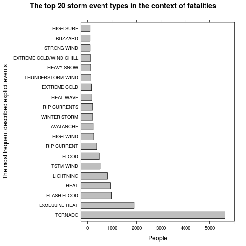
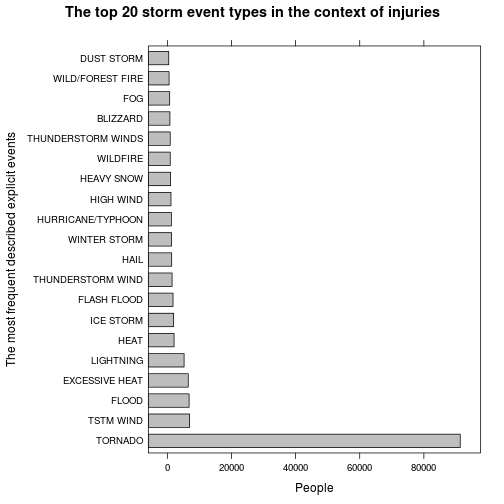
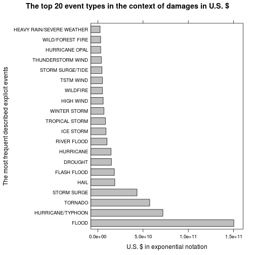

[//]: # (Hierachy of information: Research Paper)
[//]: # ( )
[//]: # (Title / Authors List)
[//]: # (Abstract)
[//]: # (Body / Results)
[//]: # (Supplementary Materials / the gory details)
[//]: # (Code / Data / really gory details)


[//]: # (Document Layout)
[//]: # ( )
[//]: # (Language: Your document should be written in English.)
[//]: # ( )
[//]: # (Title: Your document should have a title that briefly summarizes)
[//]: # (your data analysis)
[//]: # ( )
Reproducible Research-004 - Peer Assessment 2
=============================================

# Exploring the NOAA Storm Database for events with the most impact

Created by Terentius as pseudonym in 2014-07-23

[//]: # (Synopsis: Immediately after the title, there should be a synopsis)
[//]: # (which describes and summarizes your analysis in at most 10 complete)
[//]: # (sentences.)
[//]: # ( )
## Synopsis
The analysis explores the impact of the most harmful events with respect
to population health, and events with the greatest economic consequences.
The NOAA storm database is from the U.S. National Oceanic and Atmospheric
Administration (NOAA).

[//]: # (There should be a section titled Data Processing which describes)
[//]: # ((in words and code) how the data were loaded into R and processed for)
[//]: # (analysis. In particular, your analysis must start from the raw CSV)
[//]: # (file containing the data. You cannot do any preprocessing outside)
[//]: # (the document. If preprocessing is time-consuming you may consider)
[//]: # (using the cache = TRUE option for certain code chunks.)
[//]: # ( )
[//]: # (You may have other sections in your analysis, but Data Processing)
[//]: # (and Results are required.)
[//]: # ( )
## Loading and preprocessing the data

```r
# Changing the localization to get returns from functions in english language.
Sys.setlocale(category = "LC_TIME", locale = "C")
```

The database from the NOAA will be downloadeded from the Coursera.org website
from the course Reproducible Research-004 from the site "Peer Assessment 2".
The comma-separated-value (CSV) file contains the dataset which will be loaded
into the memory.

> This database tracks characteristics of major storms and weather events in
the United States, including when and where they occur, as well as estimates
of any fatalities, injuries, and property damage.  
> The events in the database start in the year 1950 and end in November 2011.
In the earlier years of the database there are generally fewer events recorded,
most likely due to a lack of good records. More recent years should be
considered more complete.  
(_Peer Assessment 2 page_)

This analysis was created with R version 3.1.1 (2014-07-10) on a platform with
x86_64-pc-linux-gnu (64-bit). The version numbers of the used packages are:  

| | | | | | | | | | |
|:---------------:|:----------:|:---------:|:--------------:|:------------:|:----------:|:---------:|:-----------:|:-------------:|:-----------:|
| lattice 0.20-29 | plyr 1.8.1 | knitr 1.6 | evaluate 0.5.5 | formatR 0.10 | grid 3.1.1 | knitr 1.6 | Rcpp 0.11.2 | stringr 0.6.2 | tools 3.1.1 |
| | | | | | | | | | |
| | | | | | | | | | |


```r
read.dataset <- function(){
        filename <- c("StormData.csv.bz2")
        # SHA1: 46b95eba9cd0c1a2904d8d5bf5ab240afd4fa4cb *StormData.csv.bz2
        uri <- c("https://d396qusza40orc.cloudfront.net/repdata%2Fdata%2FStormData.csv.bz2")
        
        dataframe.dataset <- function(filename){
                dataset <- read.csv(filename, header = TRUE)
                return(dataset)}
        if (file.exists(filename)) {
                # Read and return dataset
                return(dataframe.dataset(filename))
                } else {
                        # Does not check whether download was successful
                        download.file(url=uri,
                                      destfile=filename,
                                      method="curl")
                        # Read and return dataset
                        return(dataframe.dataset(filename))}}
# Reading data set
stormdata <- read.dataset()
```

### How is the dataset structured?


```r
# The size of the dataset
dim(stormdata)
```

```
## [1] 902297     37
```
The dataset has total of 902297 observations and 
37 variables.


```r
# An overview of the first observations.
head(stormdata,3)
```

```
##   STATE__          BGN_DATE BGN_TIME TIME_ZONE COUNTY COUNTYNAME STATE
## 1       1 4/18/1950 0:00:00     0130       CST     97     MOBILE    AL
## 2       1 4/18/1950 0:00:00     0145       CST      3    BALDWIN    AL
## 3       1 2/20/1951 0:00:00     1600       CST     57    FAYETTE    AL
##    EVTYPE BGN_RANGE BGN_AZI BGN_LOCATI END_DATE END_TIME COUNTY_END
## 1 TORNADO         0                                               0
## 2 TORNADO         0                                               0
## 3 TORNADO         0                                               0
##   COUNTYENDN END_RANGE END_AZI END_LOCATI LENGTH WIDTH F MAG FATALITIES
## 1         NA         0                      14.0   100 3   0          0
## 2         NA         0                       2.0   150 2   0          0
## 3         NA         0                       0.1   123 2   0          0
##   INJURIES PROPDMG PROPDMGEXP CROPDMG CROPDMGEXP WFO STATEOFFIC ZONENAMES
## 1       15    25.0          K       0                                    
## 2        0     2.5          K       0                                    
## 3        2    25.0          K       0                                    
##   LATITUDE LONGITUDE LATITUDE_E LONGITUDE_ REMARKS REFNUM
## 1     3040      8812       3051       8806              1
## 2     3042      8755          0          0              2
## 3     3340      8742          0          0              3
```
There is no code book available for the assignment database, but some
documentation of the variables how they are constructed/defined.
* National Weather Service Storm Data Documentation (10-1605; August 17,2007)  
http://www.nws.noaa.gov/directives/sym/pd01016005curr.pdf
* National Climatic Data Center Storm Events FAQ  
http://www.ncdc.noaa.gov/oa/climate/sd/sdfaq.html
* Storm Data Export Format, Field names  
http://www1.ncdc.noaa.gov/pub/data/swdi/stormevents/csvfiles/Storm-Data-Export-Format.docx

#### Variables

Because of the missing code book, the variables will be selected according to
the describtion from the "National Weather Service Storm Data Documentation
(10-1605; August 17,2007)":


```r
# The relevant variables to calculate the maximum values of the events types
relevantvariales <- c(8,23,24,25,26,27,28)
names(stormdata)[relevantvariales]
```

```
## [1] "EVTYPE"     "FATALITIES" "INJURIES"   "PROPDMG"    "PROPDMGEXP"
## [6] "CROPDMG"    "CROPDMGEXP"
```

The variable __EVTYPE__ will used as Storm Data Events:
> 2.1 Permitted Storm Data Events.  
The only events permitted in Storm Data are listed in Table 1 of Section 2.1.1.
The chosen event name should be the one that most accurately describes the
meteorological event leading to fatalities, injuries, damage, etc. However,
significant events, such as tornadoes, having no impact or causing no damage,
should also be included in Storm Data. See Section 7 for detailed examples. [..]  
_(National Weather Service Storm Data Documentation (10-1605; August 17,2007))_


```r
# How many different event types are in the dataset?
length(levels(stormdata$EVTYPE))
```

```
## [1] 985
```

The "2.1.1 Storm Data Event Table" in document "National Weather Service Storm
Data Documentation (10-1605; August 17,2007)" shows much less than
985 events:
> Astronomical Low Tide,
Avalanche,
Blizzard,
Coastal Flood,
Cold/Wind Chill,
Debris Flow,
Dense Fog,
Dense Smoke,
Drought,
Dust Devil,
Dust Storm,
Excessive Heat,
Extreme Cold/Wind Chill,
Flash Flood,
Flood,
Frost/Freeze,
Funnel Cloud,
Freezing Fog,
Hail,
Heat,
Heavy Rain,
Heavy Snow,
High Surf,
High Wind,
Designator,
Event Name,
Hurricane (Typhoon),
Ice Storm,
Lake-Effect Snow,
Lakeshore Flood,
Lightning,
Marine Hail,
Marine High Wind,
Marine Strong Wind,
Marine Thunderstorm Wind,
Rip Current,
Seiche,
Sleet,
Storm Surge/Tide,
Strong Wind,
Thunderstorm Wind,
Tornado,
Tropical Depression,
Tropical Storm,
Tsunami,
Volcanic Ash,
Waterspout,
Wildfire,
Winter Storm,
Winter Weather  
_(National Weather Service Storm Data Documentation (10-1605; August 17,2007))_

The strategy for EVTYPE with the values from the
Storm Data is to use them as they are and set the focus on the most frequent described explicit storm events. 

The variables for __FATALITIES, INJURIES__ will used as
Fatalities and Injuries according to:
> 2.6 Fatalities/Injuries.  
The determination of direct versus indirect causes of weather-related fatalities or injuries is one of the most difficult aspects of Storm Data preparation. Determining whether a fatality or injury was direct or indirect has to be examined on a case-by-case basis. It is impossible to include all possible cases in this Directive. The preparer should include the word “indirect” in all references to indirect fatalities or injuries in the event narrative. This will minimize any potential confusion as to what fatalities and injuries referenced in the event narrative were direct or indirect. An event narrative example follows.  
“Powerful thunderstorm winds leveled trees and power lines in and around
Morristown, TN. One of the toppled trees struck and killed two men running for
shelter. During the clean-up operations after the storm, a person on an ATV was
injured (indirect) when the vehicle struck a tree that blocked a road.”  
_(National Weather Service Storm Data Documentation (10-1605; August 17,2007))_

The strategy for FATALITIES, INJURIES with the values from
the Storm Data is to use them as they are - numeric.

The variable  __PROPDMG__ will used as damage. The
variable ___PROPDMGEXP___ will be used as exponent
for PROPDMG which is discribed as magnitude in the
following text:
> 2.7 Damage.  
Property damage estimates should be entered as actual dollar amounts, if a
reasonably accurate estimate from an insurance company or other qualified
individual is available. If this estimate is not available, then the preparer
has two choices: either check the “no information available” box, or make an
estimate. The exception is for flood events. The Storm Data preparer must
enter monetary damage amounts for flood events, even if it is a “guesstimate.”
The U.S. Army Corps of Engineers requires the NWS to provide monetary
damage amounts (property and/or crop) resulting from any flood event.  
[..]  
Estimates can be obtained from emergency managers, U.S. Geological Survey,
U.S. Army Corps of Engineers, power utility companies, and newspaper articles.
If the values provided are rough estimates, then this should be stated as such
in the narrative. Estimates should be rounded to three significant digits,
followed by an alphabetical character signifying the magnitude of the number,
i.e., 1.55B for $1,550,000,000. Alphabetical characters used to signify
magnitude include “K” for thousands, “M” for millions, and “B” for billions.
If additional precision is available, it may be provided in the narrative part
of the entry. When damage is due to more than one element of the storm,
indicate, when possible, the amount of damage caused by each element. If
the dollar amount of damage is unknown, or not available, check the
“no information available” box.  
_(National Weather Service Storm Data Documentation (10-1605; August 17,2007))_

The strategy for PROPDMG with the values from
the Storm Data is to use them as they are  - numeric in US$.


The variable  __CROPDMG__ will used as damage. The
variable ___CROPDMGEXP___ will be used as exponent
for CROPDMG also:
> 2.7.2 Crop Damage Data.  
Crop damage information may be obtained from reliable sources, such as the
U.S. Department of Agriculture (USDA), the county/parish agricultural
extension agent, the state department of agriculture, crop insurance agencies,
or any other reliable authority. Crop damage amounts may be obtained from
the USDA or other similar agencies.  
The Storm Data preparer should be very careful when using crop damage to infer
that a Thunderstorm Wind event occurred with wind gusts equal to or greater
than 50 knots (58 mph), or to infer that a Hail event occurred with hail
stones 3/4 inch or larger. Lesser wind speeds and smaller hail stones can
result in crop damage. Additional investigation will be needed in these
situations, such as contacting a person who lives in the affected area, and/or
comparing what happened to other severe weather reports in the vicinity.  
_(National Weather Service Storm Data Documentation (10-1605; August 17,2007))_

The strategy for CROPDMG with the values from
the Storm Data is to use them as they are - numeric in US$

What is the strategy for __PROPDMGEXP, CROPDMGEXP__?

There are some non-numeric characters in exponent column.

```r
# What are the exponents of PROPDMGEXP?
levels(stormdata$PROPDMGEXP)
```

```
##  [1] ""  "-" "?" "+" "0" "1" "2" "3" "4" "5" "6" "7" "8" "B" "h" "H" "K"
## [18] "m" "M"
```

```r
# How often are they used?
table(stormdata$PROPDMGEXP)
```

```
## 
##             -      ?      +      0      1      2      3      4      5 
## 465934      1      8      5    216     25     13      4      4     28 
##      6      7      8      B      h      H      K      m      M 
##      4      5      1     40      1      6 424665      7  11330
```

```r
# What are the exponents of CROPDMGEXP?
levels(stormdata$CROPDMGEXP)
```

```
## [1] ""  "?" "0" "2" "B" "k" "K" "m" "M"
```

```r
# How often are they used?
table(stormdata$CROPDMGEXP)
```

```
## 
##             ?      0      2      B      k      K      m      M 
## 618413      7     19      1      9     21 281832      1   1994
```

The strategy for PROPDMGEXP, CROPDMGEXP is to use the values as
exponent as the following:
* -, ?, + will be replaced by 0 _(and the reason is not documented)_.
* 0, 1, 2, 3, 4, 5, 6, 7, 8 will be used as they are _(and the reason is not documented)_.
* h, H will be replaced by 2
* k, K will be replaced by 3
* m, M will be replaced by 6
* B will be replaced by 9 (because of american currency).
* NA will be replaced by 0 _(and the reason is not documented)_.

```r
# This function replaces certain characters/factors with numeric values to be
# usable as exponent on columns PROPDMGEXP and CROPDMGEXP.
# Complete list is mentioned above.
expreplacement <- function() {
        stormdata$PROPDMGEXP <<- as.character(stormdata$PROPDMGEXP)
        stormdata$PROPDMGEXP <<- toupper(stormdata$PROPDMGEXP)
        stormdata$PROPDMGEXP[(stormdata$PROPDMGEXP == "-") |
                             (stormdata$PROPDMGEXP == "+") |
                             (stormdata$PROPDMGEXP == "?")] <<- "0"
        stormdata$PROPDMGEXP[(stormdata$PROPDMGEXP == "H")] <<- "2"
        stormdata$PROPDMGEXP[(stormdata$PROPDMGEXP == "K")] <<- "3"
        stormdata$PROPDMGEXP[(stormdata$PROPDMGEXP == "M")] <<- "6"
        stormdata$PROPDMGEXP[(stormdata$PROPDMGEXP == "B")] <<- "9"
        stormdata$PROPDMGEXP <<- as.numeric(stormdata$PROPDMGEXP)
        stormdata$PROPDMGEXP[is.na(stormdata$PROPDMGEXP)] <<- 0

        
        stormdata$CROPDMGEXP <<- as.character(stormdata$CROPDMGEXP)
        stormdata$CROPDMGEXP <<- toupper(stormdata$CROPDMGEXP)
        stormdata$CROPDMGEXP[(stormdata$CROPDMGEXP == "?")] <<- "0"
        stormdata$CROPDMGEXP[(stormdata$CROPDMGEXP == "K")] <<- "3"
        stormdata$CROPDMGEXP[(stormdata$CROPDMGEXP == "M")] <<- "6"
        stormdata$CROPDMGEXP[(stormdata$CROPDMGEXP == "B")] <<- "9"
        stormdata$CROPDMGEXP <<- as.numeric(stormdata$CROPDMGEXP)
        stormdata$CROPDMGEXP[is.na(stormdata$CROPDMGEXP)] <<- 0
}
```

#### Validate the assumption

```r
# What time period will be covert in format year-month-day?
range(as.Date(stormdata$BGN_DATE,format="%m/%d/%Y"))
```

```
## [1] "1950-01-03" "2011-11-30"
```

## Processing the data

[//]: # (Consider writing your report as if it were to be read by a government)
[//]: # (or municipal manager who might be responsible for preparing for)
[//]: # (severe weather events and will need to prioritize resources for)
[//]: # (different types of events. However, there is no need to make any)
[//]: # (specific recommendations in your report.)
[//]: # ( )

[//]: # (The analysis document must have at least one figure containing a plot.)
[//]: # ( )
[//]: # (Your analyis must have no more than three figures. Figures may have)
[//]: # (multiple plots in them (i.e. panel plots), but there cannot be more)
[//]: # (than three figures total.)
[//]: # ( )

[//]: # (Questions)
[//]: # ( )
[//]: # (Your data analysis must address the following questions:)
[//]: # ( )
[//]: # (1. Across the United States, which types of events (as indicated)
[//]: # (   in the EVTYPE variable) are most harmful with respect to)
[//]: # (   population health?)
[//]: # ( )
### Across the United States, which types of events are most harmful with respect to population health?

Two plots showing the impact on fatalities and injuries in relation to the event
types


```r
library(plyr)
# counting the total sum of fatalities and injuries in relation for each
# event type
harmedpopulation <- ddply(stormdata,
                          .(EVTYPE),
                          summarize,
                          totalfatalities = sum(FATALITIES),
                          totalinjuries = sum(INJURIES))


# Ordering the top 20 event types decreasing of totalfatalities
top20.fatalities <-
        harmedpopulation[
                order(harmedpopulation$totalfatalities,
                      decreasing=TRUE),
                c("EVTYPE","totalfatalities")][c(1:20),]

# Ordering the top 20 event types decreasing of totalinjuries
top20.injuries <-
        harmedpopulation[
                order(harmedpopulation$totalinjuries,
                      decreasing=TRUE),
                c("EVTYPE","totalinjuries")][c(1:20),]


# Preparing the top 20 data for the plot fatalities
plot.top20.fatalities <- top20.fatalities$totalfatalities
names(plot.top20.fatalities) <- as.character(top20.fatalities$EVTYPE)

library(lattice)
barchart(plot.top20.fatalities,
         horizontal=TRUE,
         xlab ="People",
         ylab ="The most frequent described explicit events",
         col="grey",
         main="The top 20 storm event types in the context of fatalities")
```

 

```r
# The top 20 storm events as a table with absolut values how many people died
# and counted as fatalities
plot.top20.fatalities
```

```
##                 TORNADO          EXCESSIVE HEAT             FLASH FLOOD 
##                    5633                    1903                     978 
##                    HEAT               LIGHTNING               TSTM WIND 
##                     937                     816                     504 
##                   FLOOD             RIP CURRENT               HIGH WIND 
##                     470                     368                     248 
##               AVALANCHE            WINTER STORM            RIP CURRENTS 
##                     224                     206                     204 
##               HEAT WAVE            EXTREME COLD       THUNDERSTORM WIND 
##                     172                     160                     133 
##              HEAVY SNOW EXTREME COLD/WIND CHILL             STRONG WIND 
##                     127                     125                     103 
##                BLIZZARD               HIGH SURF 
##                     101                     101
```

```r
# Preparing the top 20 data for the plot injuries
plot.top20.injuries <- top20.injuries$totalinjuries
names(plot.top20.injuries) <- as.character(top20.injuries$EVTYPE)

barchart(plot.top20.injuries,
         horizontal=TRUE,
         xlab ="People",
         ylab ="The most frequent described explicit events",
         col="grey",
         main="The top 20 storm event types in the context of injuries")
```

 

```r
# The top 20 storm events as a table with absolut values how many people were
# injured and counted as injuries
plot.top20.injuries
```

```
##            TORNADO          TSTM WIND              FLOOD 
##              91346               6957               6789 
##     EXCESSIVE HEAT          LIGHTNING               HEAT 
##               6525               5230               2100 
##          ICE STORM        FLASH FLOOD  THUNDERSTORM WIND 
##               1975               1777               1488 
##               HAIL       WINTER STORM  HURRICANE/TYPHOON 
##               1361               1321               1275 
##          HIGH WIND         HEAVY SNOW           WILDFIRE 
##               1137               1021                911 
## THUNDERSTORM WINDS           BLIZZARD                FOG 
##                908                805                734 
##   WILD/FOREST FIRE         DUST STORM 
##                545                440
```


[//]: # (Questions)
[//]: # ( )
[//]: # (2. Across the United States, which types of events have the)
[//]: # (   greatest economic consequences?)
[//]: # ( )
### Across the United States, which types of events have the greatest economic consequences?

```r
# Clean up the PROPDMGEXP and CROPDMGEXP column to use it as exponent.
expreplacement()

library(plyr)
damage <- ddply(stormdata,
                .(EVTYPE),
                summarize,
                totalcost = sum(PROPDMG*10^PROPDMGEXP + CROPDMG*10^CROPDMGEXP))

# All costs which are indexed with EVTYPE
top20.totalcost <- damage$totalcost
names(top20.totalcost) <- as.character(damage$EVTYPE)

# Only the top 20 events causing the greatest costs
top20.totalcost <- top20.totalcost[order(top20.totalcost,
                                         decreasing=TRUE)][c(1:20)]

library(lattice)
barchart(top20.totalcost,
         horizontal=TRUE,
         xlab ="U.S. $ in exponential notation",
         ylab ="The most frequent described explicit events",
         col="grey",
         main="The top 20 event types in the context of damages in U.S. $")
```

 

```r
# The top 20 storm events as a table with absolut cumulativ values of property
# damage and crop damage.
top20.totalcost
```

```
##                     FLOOD         HURRICANE/TYPHOON 
##                 1.503e+11                 7.191e+10 
##                   TORNADO               STORM SURGE 
##                 5.736e+10                 4.332e+10 
##                      HAIL               FLASH FLOOD 
##                 1.876e+10                 1.824e+10 
##                   DROUGHT                 HURRICANE 
##                 1.502e+10                 1.461e+10 
##               RIVER FLOOD                 ICE STORM 
##                 1.015e+10                 8.967e+09 
##            TROPICAL STORM              WINTER STORM 
##                 8.382e+09                 6.715e+09 
##                 HIGH WIND                  WILDFIRE 
##                 5.909e+09                 5.061e+09 
##                 TSTM WIND          STORM SURGE/TIDE 
##                 5.039e+09                 4.642e+09 
##         THUNDERSTORM WIND            HURRICANE OPAL 
##                 3.898e+09                 3.192e+09 
##          WILD/FOREST FIRE HEAVY RAIN/SEVERE WEATHER 
##                 3.109e+09                 2.500e+09
```


```r
# Changing the localization back in origin sate.
Sys.setlocale(locale = "") 
```

[//]: # (There should be a section titled Results in which your results are)
[//]: # (presented.)
[//]: # ( )
## Results

The following resultes are between the time period
``1950-01-03`` and
``2011-11-30`` from the
storm data:
* ``FLOOD`` is the most reason causing a damage on the
U.S. economy with U.S. $
``1.5e+11``.

* ``TORNADO`` was the most reason, that people died
in the U.S. with
``5633`` people.

* And ``TORNADO`` was the most reason, that people
were injured in the U.S. with
``91346`` people.


[//]: # (You must show all your code for the work in your analysis document.)
[//]: # (This may make the document a bit verbose, but that is okay. In)
[//]: # (general, you should ensure that echo = TRUE for every code chunk)
[//]: # ((this is the default setting in knitr).)


